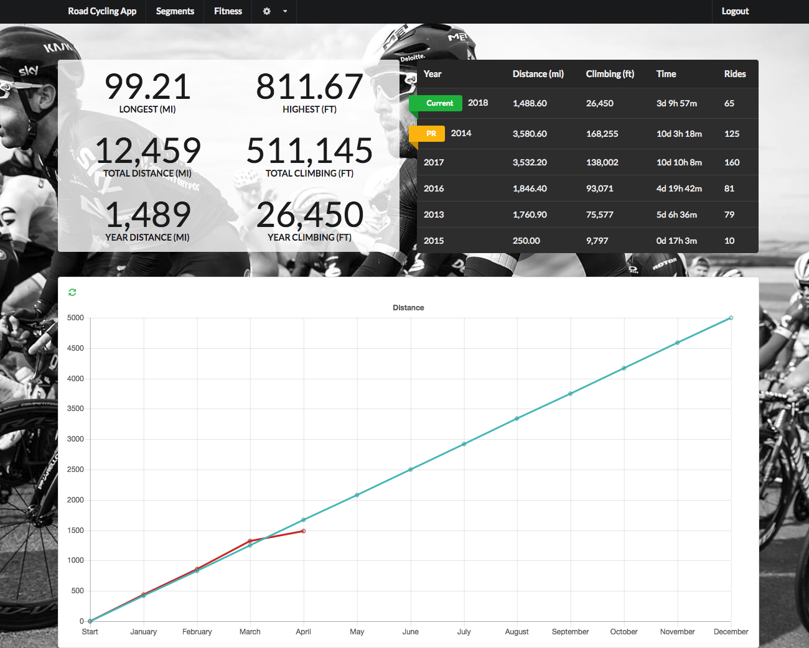
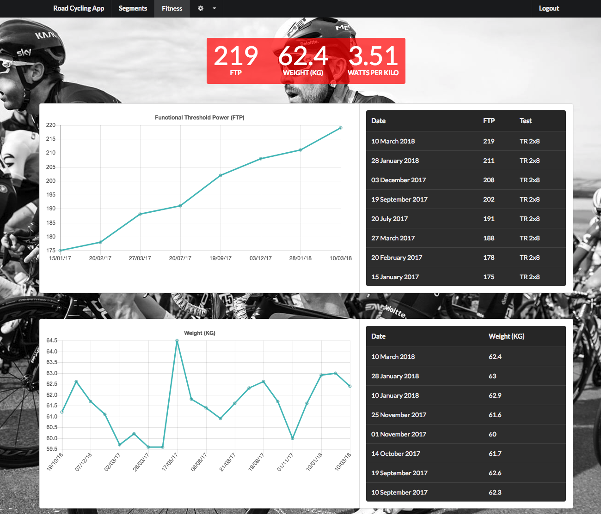

# Cycling App

Node.js app to monitor and report on cycling fitness. Uses the Strava API to pull in data and Semantic UI to display it.

  - Weight
  - FTP
  - Miles/elevation per year
  - Segment times
  - Progress against yearly target

## Screenshots

